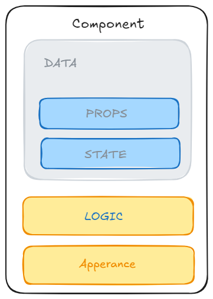

- Step by Step

- Delete every from `index.html` and `index.js`
- Inside `index.html` create a div `<div id="root"></div>`
- Inside `index.js` write the following

  - import `React` and `ReactDOM`

  ```
  import React from 'react'
  import ReactDOM from 'react-dom/client'

  ```

  - Select the `#root`

  ```
  const root = ReactDOM.createRoot(document.querySelector('#root'))
  ```

  - create a component / function

  ```
  const App = function(){
    return <h1>Hello World!!!</h1>
  }

  ```

  - Render the `App` component inside `root`

  ```
  root.render(
  <React.StrictMode>
    <App />
  </React.StrictMode>
  );
  ```

# Seperation of COncern

- One components per FILE

- CReate different file for CSS `index.css`

# Import CSS

```
import "./index.css"
```

- to add classes to component use `className = "class name"`

# PROPS

- props are the object that contains the data

# Reviewing PROPS

- Props are used to pass data from `PARENT COMPONENT` to `CHILDREN COMPONENT`
- PROPS are like Arguments passed to a FUnction
- Any Value can be passes as `PROPS` : `Single Value`,`Arrays`, `Objects`,`Functions`,`Even other components`

For Example :

```JS
const CourseRating=()=>{
const[rating, setRating]= useState[0];

return(
<Rating
text="Course rating"
currentRating={rating}
numOptions={3}
options={["Terible","OKAY","Amazing"]}
allRating={{num:2390, avg:4.9}}
setRating={setRating}
component={Star}
/>

);
}

const Star = ()=>{
  //To do
}
```

### PROPS are READ ONLY

- 
- DATA is madeup of `props` and `state`

- `State` is the data coming from the component's logic
- `PROPS` is the data coming from the outside and only can be updated by `Parent Component`
  - `PROPS` are immutable
  - if u need to mutate a props, and actually need `STATE`

## ONE WAY DATA FLOW

- In React, Data can only be passed from PArent to CHILD

# React Fragment

- <></>

# Class with Condition
